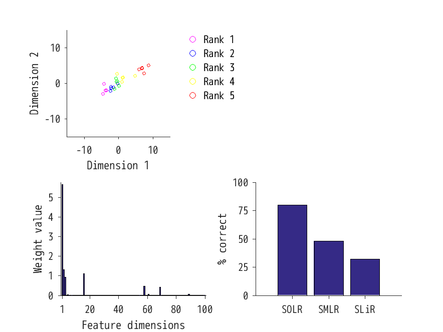

# MATLAB implementation of SOLR
Sparse ordinal logistic regression (SOLR) is a machine learning algorithm to predict ordinal variables. <br>
This repository provides a MATLAB implementation of SOLR. <br> <br>
For the details of the algorithm, please see <br> <br>
Sparse ordinal logistic regression and its application to brain decoding. <br>
Emi Satake, Kei Majima, Shuntaro Aoki, Yukiyasu Kamitani. 2017. <br>
https://www.biorxiv.org/content/early/2017/12/22/238758.

## Core fucntions & demo codes
<ul>
  <li>SOLRtrain.m: A function for SOLR model training.</li>
  <li>SOLRpredict.m: A function for prediction.</li>
  <li>demoSOLR_20171227.m: Demo code of SOLR.</li>
  <li>demoComp_SOLRvsSMLRvsSLiR_20171227.m: Demo comparison across prediction methods.</li>
</ul>

## How to use
After adding “subfunction” folder to the MATLAB path, please type
```
>> model = SOLRtrain(feature,label);
>> predictedLabel = SOLRpredict(feature,model);
```
. Here, 
<ul>
  <li>feature: a matrix (# of training samples x # of dimensions).</li>
  <li>label: a vector including label information (# of training samples x 1; elements must be natural numbers).</li>
</ul>
“model” contains the parameters after model training, 
and SOLRpredict returns predictions based on it.

## Demonstration
demoComp_SOLRvsSMLRvsSLiR_20171227.m <br>

