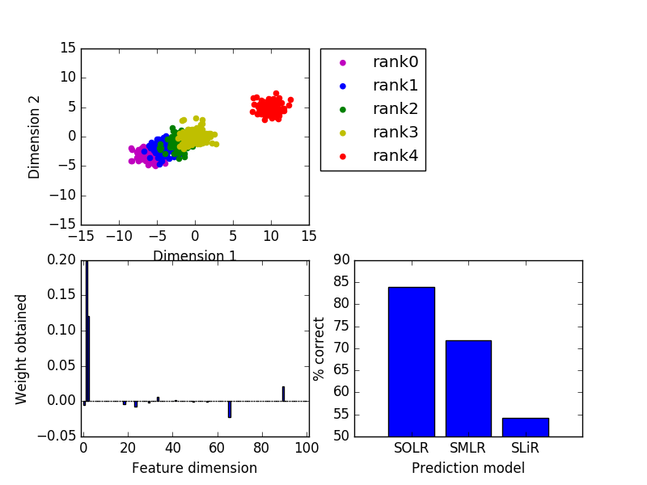

# Python implementation of SOLR
Sparse ordinal logistic regression (SOLR) is a machine learning algorithm to predict ordinal variables. <br>
This repository provides a Python implementation of SOLR. <br> <br>
For the details of the algorithm, please see <br> <br>

Satake, E., Majima, K., Aoki, S.C., and Kamitani, Y. (2018). Sparse Ordinal Logistic Regression and Its Application to Brain Decoding. Frontiers in Neuroinformatics. <https://doi.org/10.3389/fninf.2018.00051>

## Core fucntions & demo codes
<ul>
  <li>SOLR.py: A function for model training and prediction.</li>
  <li>demoSOLR_20171227.py: Demo code of SOLR.</li>
  <li>demoComp_SOLRvsSMLRvsSLiR_20171227.py: Demo comparison across prediction methods.</li>
</ul>

## How to use
Please type
```
>> import SOLR
>> solr = SOLR.SOLR()
>> solr.fit(feature,label)
>> predictedLabel = solr.predict(feature,model)
```
. Here, 
<ul>
  <li>feature: a numpy array (# of training samples x # of dimensions).</li>
  <li>label: a numpy array including label information (# of training samples x 1; elements must be nonnegative integers).</li>
</ul>
The output array (predictedLabel) contains predictions by SOLR.

## Demonstration
demoComp_SOLRvsSMLRvsSLiR_20171227.py <br>

